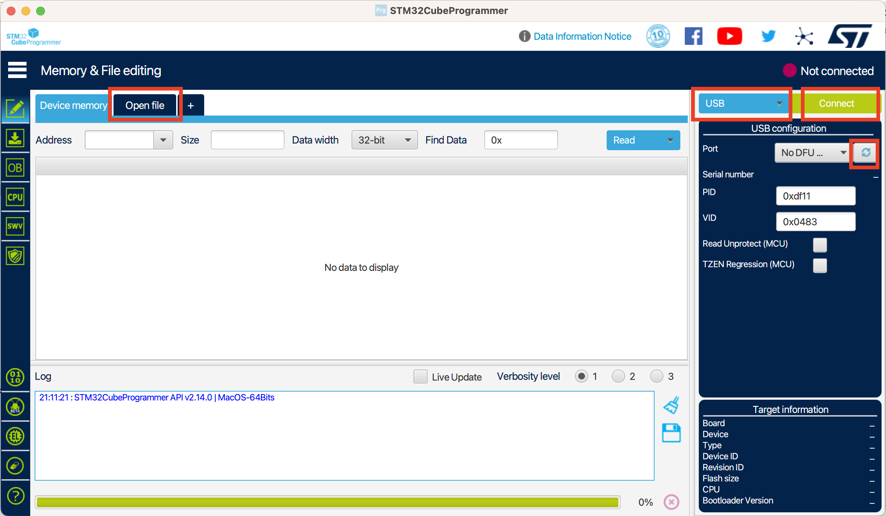
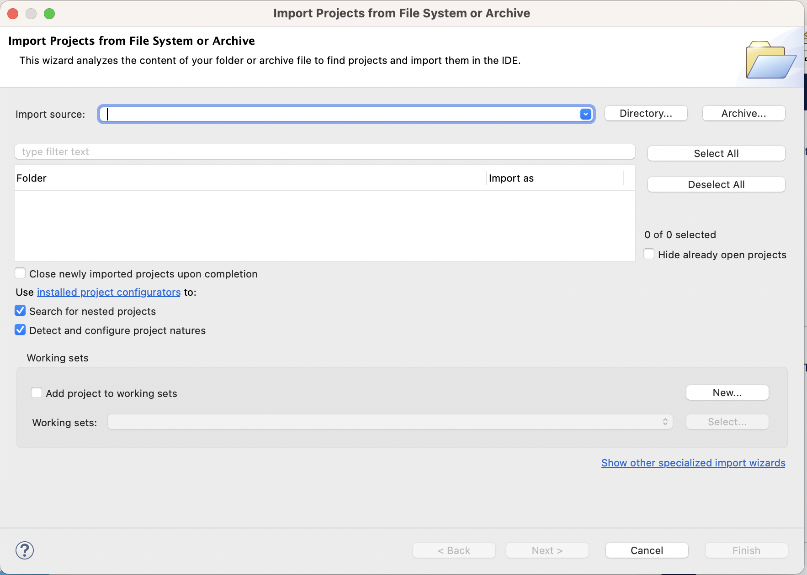
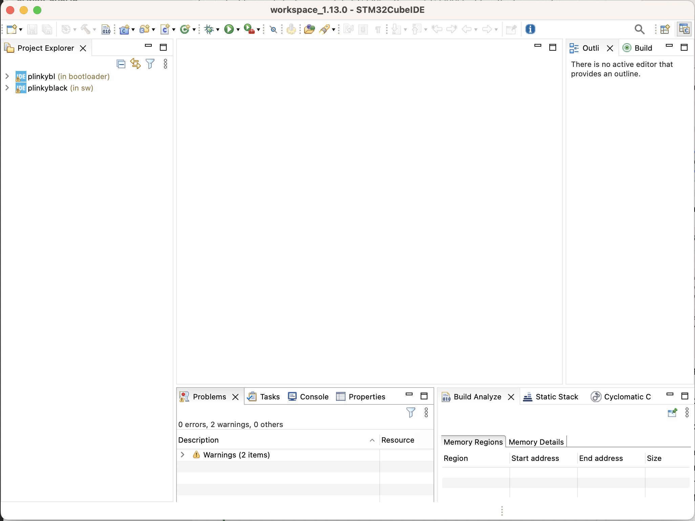

# Build Guide

## Hardware

Order from JLC :)

TODO: more info

## Software

### Flashing a Blank Plinky

It's possible to flash a freshly manufactured Plinky without building the software. You can get the
latest firmware as a `.bin` file from the
[releases page](https://github.com/ember-labs-io/Plinky_LPE/releases).

The bin file is typically named `plink09z.bin` or similar, where the last 3 digits represent the
version number. Note that the `.uf2` version is the main firmware and can be installed via Plinky's
bootloader (detailed in this manual). However, that only works once the bootloader is on Plinky
first — a freshly manufactured Plinky has no bootloader, so you need the `.bin` file.

Use **STM32CubeProgrammer** (free from [ST](https://www.st.com/en/development-tools/stm32cubeprog.html))
to flash the bin file.

!!! note "macOS users"
    STM32CubeProgrammer can have issues on macOS. After allowing it in **Settings → Privacy & Security**,
    it may still hang. If so, try the
    [ST community thread](https://community.st.com/t5/stm32cubeprogrammer-mcu/how-to-download-stm32cubeprogrammer-on-macos-monterey-12-6/m-p/143983).

When STM32CubeProgrammer opens you'll see this screen:



#### Connecting via BOOT0

1. Find the **BOOT0** and nearby **3V3** pads on the back of Plinky
1. Short them together with a piece of metal **before and while** plugging Plinky in via USB
1. Once power is applied over USB, remove the metal

Inside STM32CubeProgrammer:

1. Click **Open file** and load your `.bin` file
1. Select **USB** as the connection type on the right
1. Click the **Refresh** icon — if it says "No DFU", the BOOT0 + 3V3 short didn't work; unplug, retry
1. Click **Connect**, then **DOWNLOAD** to flash
1. Unplug and replug — Plinky will enter calibration mode

### Building the Firmware from Source

1. Check out [github.com/ember-labs-io/Plinky_LPE](https://github.com/ember-labs-io/Plinky_LPE)
1. Install **STM32CubeIDE** (free from [ST](https://www.st.com/en/development-tools/stm32cubeide.html));
   at the time of writing, version 1.13 is current
1. Ensure Python 3.x is installed and accessible from the command line

On first launch, STM32CubeIDE will ask you to import a project:



Click **Directory...** and select the root of your checkout. Check the **sw** project (main firmware)
and the **bootloader** project; uncheck the root folder. Click OK.



Right-click each project → **Build Configurations → Set Active → Release**.

Go to **Project → Build All**.

If the build succeeds, run `binmaker.py` from the repo root:

```
python binmaker.py
```

Example output:

```
456950 app, 30968 bootloader
bootloader size 65536, app size 456950, version 09z
outputting plink09z.bin...
outputting plink09z.uf2...
Converting to uf2, output size: 873472, start address: 0x8010000
Wrote 873472 bytes to plink09z.uf2
```

This produces `plink09z.bin` and `plink09z.uf2`:

- **`.bin`** — flash a raw Plinky using the BOOT0 method above
- **`.uf2`** — update the app portion via Plinky's bootloader (once it's already installed)

______________________________________________________________________

## Troubleshooting

TODO

______________________________________________________________________

## Booting a Raw Plinky for the First Time

Analog voltage calibration process docs — TODO
